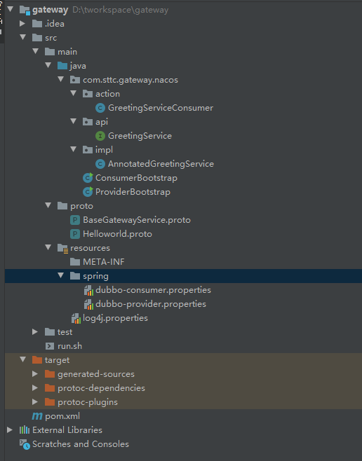

## 一、安装并启动nacos
1、在nacos官网下载nacos的对应安装包https://github.com/alibaba/nacos/releases/，windows下载.zip结尾的包,然后解压安装即可。

2、如果没有mysql环境需要先下载配置mysql环境，在mysql下面建立一个名为nacos的库（比较好分别），然后运行./conf/nacos-mysql.sql中的语句。

3、启动nacos，在windows下单机启动，使用cmd命令行到./bin目录下然后运行startup.cmd -m standalone，以单机模式启动。

## 一、pom文件以及项目结构
1、项目结构

proto文件下面放入通信所需实体相关定义文件

2、pom文件

使用triple协议进行通信，以便支持跨语言的调用，所以需要加入protobuf相关的依赖，如果要生成proto文件对应的java文件，在maven里面选择protobuf的插件，运行compile即可。

在这之后会生成对应java文件。
<pre><code class="language-xml">
<?xml version="1.0" encoding="UTF-8"?>
<project xmlns="http://maven.apache.org/POM/4.0.0"
         xmlns:xsi="http://www.w3.org/2001/XMLSchema-instance"
         xsi:schemaLocation="http://maven.apache.org/POM/4.0.0 http://maven.apache.org/xsd/maven-4.0.0.xsd">
    <modelVersion>4.0.0</modelVersion>

    <groupId>org.sttc.service</groupId>
    <artifactId>gateway</artifactId>
    <version>1.0-SNAPSHOT</version>
    <properties>
        <source.level>1.8</source.level>
        <target.level>1.8</target.level>
        <dubbo.version>3.0.2</dubbo.version>
        <grpc.version>1.19.0</grpc.version>
        <junit.version>4.12</junit.version>
        <spring-test.version>4.3.16.RELEASE</spring-test.version>
        <maven-compiler-plugin.version>3.7.0</maven-compiler-plugin.version>
        <maven-failsafe-plugin.version>2.21.0</maven-failsafe-plugin.version>
        <spring-boot.version>1.5.13.RELEASE</spring-boot.version>
        <protoc.version>3.7.1</protoc.version>
        <dubbo.compiler.version>0.0.4-SNAPSHOT</dubbo.compiler.version>
        <slf4j.version>1.7.25</slf4j.version>
    </properties>

    <dependencyManagement>
        <dependencies>

            <dependency>
                <groupId>org.apache.dubbo</groupId>
                <artifactId>dubbo-bom</artifactId>
                <version>${dubbo.version}</version>
                <type>pom</type>
                <scope>import</scope>
            </dependency>

            <dependency>
                <groupId>org.apache.dubbo</groupId>
                <artifactId>dubbo-dependencies-zookeeper</artifactId>
                <version>${dubbo.version}</version>
                <type>pom</type>
            </dependency>

            <dependency>
                <groupId>junit</groupId>
                <artifactId>junit</artifactId>
                <version>${junit.version}</version>
            </dependency>

        </dependencies>
    </dependencyManagement>

    <dependencies>

        <dependency>
            <artifactId>lombok</artifactId>
            <groupId>org.projectlombok</groupId>
            <version>1.18.8</version>
        </dependency>

        <dependency>
            <groupId>org.apache.dubbo</groupId>
            <artifactId>dubbo</artifactId>
            <version>${dubbo.version}</version>
        </dependency>

        <dependency>
            <groupId>com.google.protobuf</groupId>
            <artifactId>protobuf-java</artifactId>
            <version>3.14.0</version>
        </dependency>

        <dependency>
            <groupId>org.apache.dubbo</groupId>
            <artifactId>dubbo-dependencies-zookeeper</artifactId>
            <version>${dubbo.version}</version>
            <type>pom</type>
        </dependency>

        <dependency>
            <groupId>org.slf4j</groupId>
            <artifactId>slf4j-api</artifactId>
            <version>${slf4j.version}</version>
        </dependency>

        <dependency>
            <groupId>org.apache.dubbo</groupId>
            <artifactId>dubbo-configcenter-nacos</artifactId>
        </dependency>

        <dependency>
            <groupId>org.apache.dubbo</groupId>
            <artifactId>dubbo-registry-nacos</artifactId>
        </dependency>

        <dependency>
            <groupId>org.apache.dubbo</groupId>
            <artifactId>dubbo-serialization-api</artifactId>
            <version>2.7.12</version>
        </dependency>

        <dependency>
            <groupId>org.apache.dubbo</groupId>
            <artifactId>dubbo-serialization-protobuf</artifactId>
            <version>2.7.12</version>
        </dependency>

        <dependency>
            <groupId>com.google.protobuf</groupId>
            <artifactId>protobuf-java</artifactId>
        </dependency>

        <dependency>
            <groupId>com.google.protobuf</groupId>
            <artifactId>protobuf-java-util</artifactId>
        </dependency>
    </dependencies>-
    <build>
        <extensions>
            <extension>
                <groupId>kr.motd.maven</groupId>
                <artifactId>os-maven-plugin</artifactId>
                <version>1.6.1</version>
            </extension>
        </extensions>
        <plugins>
            <plugin>
                <groupId>org.xolstice.maven.plugins</groupId>
                <artifactId>protobuf-maven-plugin</artifactId>
                <version>0.6.1</version>
                <configuration>
                    <protocArtifact>com.google.protobuf:protoc:3.17.3:exe:${os.detected.classifier}</protocArtifact>
                    <pluginId>triple-java</pluginId>
                </configuration>
                <executions>
                    <execution>
                        <goals>
                            <goal>compile</goal>
                            <goal>test-compile</goal>
                            <goal>compile-custom</goal>
                            <goal>test-compile-custom</goal>
                        </goals>
                    </execution>
                </executions>
            </plugin>

            <plugin>
                <groupId>org.apache.maven.plugins</groupId>
                <artifactId>maven-compiler-plugin</artifactId>
                <version>${maven-compiler-plugin.version}</version>
                <configuration>
                    <source>${source.level}</source>
                    <target>${target.level}</target>
                </configuration>
            </plugin>

            <plugin>
                <groupId>org.codehaus.mojo</groupId>
                <artifactId>build-helper-maven-plugin</artifactId>
                <executions>
                    <execution>
                        <phase>generate-sources</phase>
                        <goals>
                            <goal>add-source</goal>
                        </goals>
                        <configuration>
                            <sources>
                                <source>build/generated/source/proto/main/java</source>
                            </sources>
                        </configuration>
                    </execution>
                </executions>
            </plugin>
        </plugins>
    </build>

</project>
</code></pre>

3、项目代码

项目代码在https://github.com/AllenRdm/gateway-demo/tree/master/src/main/java/com/sttc/gateway/nacos，
修改dubbo-consumer.properties和dubbo-provider.properties中的nacos路径，然后先后运行ProviderBootstrap.java和ConsumerBootstrap.java。

